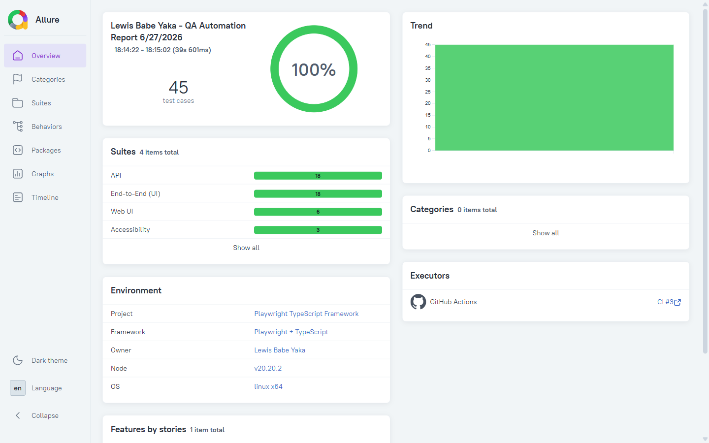

# Playwright + TypeScript Test Automation Framework

[](https://github.com/lebrodus/playwright-typescript-framework/actions/workflows/playwright.yml)
[](https://lebrodus.github.io/playwright-typescript-framework/)
[](https://www.typescriptlang.org/)
[](https://playwright.dev/)

📊 **[View the live Allure report →](https://lebrodus.github.io/playwright-typescript-framework/)** (published from CI on every push to `main`)

[](https://lebrodus.github.io/playwright-typescript-framework/)

A production-style end-to-end, API and web test automation framework built with **Playwright** and **TypeScript**. It demonstrates the patterns I use day to day as an SDET: the **Page Object Model**, **custom fixtures**, strongly typed test data, cross-browser execution, and a **CI pipeline** on GitHub Actions.

> All suites run against stable public targets (Playwright TodoMVC, the Playwright docs site, and JSONPlaceholder), so the project is clone-and-run with no secrets or setup.

## Highlights

- **Page Object Model** with a shared `BasePage` and typed, intention-revealing methods.
- **Custom fixtures** that inject ready-to-use page objects, keeping specs declarative.
- **Five layers of coverage**: UI end-to-end, web-UI smoke, REST API (no browser), **accessibility** (axe-core), and **visual regression**.
- **Accessibility testing** with `@axe-core/playwright` against WCAG 2.0/2.1 A & AA, via a shared `makeAxeBuilder` fixture.
- **Visual regression** with Playwright's native snapshot comparison (element-level baselines, tolerance + disabled animations).
- **Test tagging** (`@smoke` / `@regression`) for fast, selective runs locally and in CI.
- **Cross-browser + mobile**: Chromium, Firefox, WebKit and an emulated mobile project.
- **CI/CD**: a lint/type-check quality gate, a cross-browser matrix with a manual suite/browser picker, and Allure published to GitHub Pages.
- **Code quality enforced**: ESLint (incl. `no-floating-promises`) + Prettier + a Husky pre-commit hook (lint-staged), plus Dependabot.
- **Allure reporting**: rich, history-aware reports, published live on every push to `main`.
- **Robust by default**: auto-waiting locators, retries on CI, trace/screenshot/video on failure.
- **Strict TypeScript**: `strict`, no unused locals/params, path aliases.

## Tech Stack

`Playwright` · `TypeScript` · `Node.js` · `GitHub Actions` · `REST API testing` · `Accessibility (axe-core)` · `Visual Regression` · `Allure` · `ESLint` · `Prettier` · `Page Object Model`

## Project Structure

```
playwright-typescript-framework/
├─ src/
│  ├─ pages/         # Page Objects (BasePage, TodoPage)
│  ├─ fixtures/      # Custom Playwright fixtures
│  └─ data/          # Reusable, typed test data
├─ tests/
│  ├─ e2e/           # End-to-end UI flows (TodoMVC)
│  ├─ web/           # Web-UI smoke tests (playwright.dev)
│  ├─ api/           # REST API tests (JSONPlaceholder)
│  ├─ a11y/          # Accessibility tests (axe-core)
│  └─ visual/        # Visual regression (snapshot baselines)
├─ .github/
│  ├─ workflows/playwright.yml   # quality gate + matrix + Allure publish
│  └─ dependabot.yml
├─ .husky/pre-commit             # lint-staged + type-check
├─ eslint.config.js
├─ .prettierrc.json
├─ playwright.config.ts
└─ tsconfig.json
```

## Getting Started

```bash
# 1. Install dependencies
npm install

# 2. Install browsers
npx playwright install

# 3. Run the whole suite
npm test
```

### Useful scripts

| Command                      | Description                                           |
| ---------------------------- | ----------------------------------------------------- |
| `npm test`                   | Run all tests, all browsers                           |
| `npm run test:e2e`           | UI end-to-end suite only                              |
| `npm run test:api`           | REST API suite only                                   |
| `npm run test:web`           | Web-UI smoke suite only                               |
| `npm run test:a11y`          | Accessibility (axe-core) suite only                   |
| `npm run test:visual`        | Visual regression suite (compare to baselines)        |
| `npm run test:visual:update` | Regenerate visual baselines                           |
| `npm run test:smoke`         | Run only `@smoke`-tagged tests                        |
| `npm run test:regression`    | Run only `@regression`-tagged tests                   |
| `npm run test:chromium`      | Run on Chromium only                                  |
| `npm run test:ui`            | Open the Playwright UI mode                           |
| `npm run report`             | Open the last HTML report                             |
| `npm run allure:serve`       | Build & open the Allure report (one step)             |
| `npm run typecheck`          | Type-check with `tsc --noEmit`                        |
| `npm run lint`               | Lint with ESLint                                      |
| `npm run format`             | Format with Prettier                                  |
| `npm run validate`           | typecheck + lint + format check (the CI quality gate) |

## Reporting

Every run produces three reports:

- **Playwright HTML** - `npm run report`
- **JSON** - `test-results/results.json` (for custom dashboards / CI parsing)
- **Allure (live)** - published to GitHub Pages by CI on every push to `main`, with trend history across runs: **https://lebrodus.github.io/playwright-typescript-framework/**
- **Allure (local)** - rich report with steps, attachments and trends:

```bash
npm test                 # produces allure-results/
npm run allure:serve     # builds and opens the Allure report
```

> Allure report generation uses the Allure CLI, which requires **Java 8+** on the machine generating the report. Test execution itself needs no Java.

## Code Quality & Accessibility

- **Quality gate** - `npm run validate` (type-check + ESLint + Prettier) runs as the first CI job; the browser matrix only starts if it passes.
- **ESLint** - TypeScript rules incl. `@typescript-eslint/no-floating-promises` (catches missing `await` on Playwright calls) and `eslint-plugin-playwright` best-practice rules.
- **Prettier** - single source of truth for formatting; ESLint defers to it via `eslint-config-prettier`.
- **Pre-commit hook** - Husky + lint-staged auto-fix and format staged files, then type-check, before every commit.
- **Accessibility** - `@axe-core/playwright` scans against WCAG 2.0/2.1 A & AA; criticals fail the build, all violations are attached to the report for triage.
- **Dependabot** - weekly npm + GitHub Actions update PRs to keep dependencies current.

## Test Design Notes

- **Locators** prefer user-facing roles and test IDs (`getByRole`, `getByTestId`) over brittle CSS/XPath.
- **Assertions** use Playwright's web-first `expect`, which auto-retries and removes flaky sleeps.
- **Data and pages are separated from specs** so tests read as behaviour, not setup.
- **API tests** validate status codes, response shape (contract) and a negative path.
- **Tags** (`@smoke`, `@regression`) drive selective execution - e.g. `npm run test:smoke` for a fast pre-merge check.

## Author

**Lewis Babe Yaka** - QA Tech Lead & SDET
[LinkedIn](https://www.linkedin.com/in/lewis-babe-yaka)

## License

MIT
